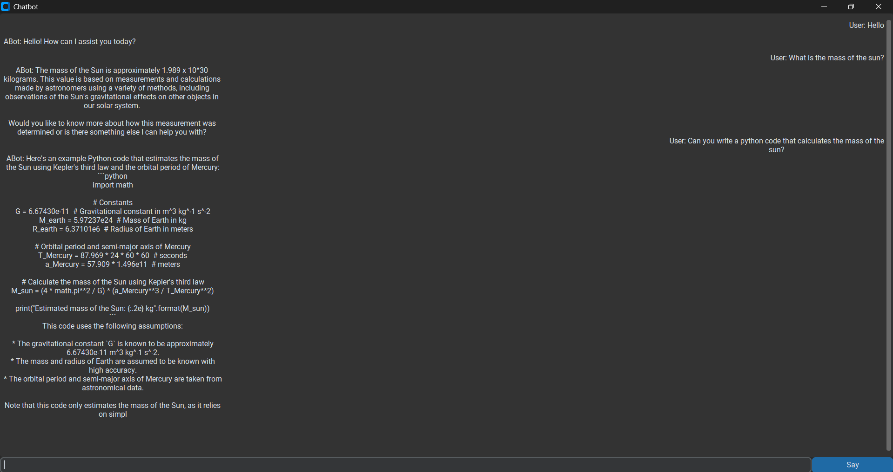

# Chat App 🤖

 &nbsp;
 &nbsp;
 &nbsp;
 &nbsp;
 &nbsp;


A simple chatbot with a **custom GUI** built using [customtkinter](https://github.com/TomSchimansky/CustomTkinter) and [Ollama](https://ollama.com).
Developed when I was 11 years old and published in github when i was 11 yearso old.

<p align="center">
  <br>
  <em>Main Chat Window</em>
</p>


---

## 🚀 Features
- Chatbot powered by Ollama
- Custom GUI with clean, minimal design
- Lightweight and easy to run
- Special commands:
    - `/exit`, `/quit`, `/leave` → exit the program
    - `/clear`, `/cls` → clear messages
    - `/reset`, `/restart` → clear history + reset chat

---


## 📦 Requirements
- Python 3.x
- `customtkinter` library
- Ollama CLI with a model of your choice

---

## ⚙️ Setup

### 1️⃣ Install customtkinter:
Open **cmd** and run:
```bash
pip install customtkinter
```
### 2️⃣ Install Ollama model:
Open **cmd** and run:
```bash
ollama pull [model_name]
```
Example:
```bash
ollama pull llama3.1:8b
```
Check installed models:
```bash
ollama list
```
## ▶️ Run the Chatbot
Navigate to the folder containing the project:
```bash
cd [path_to_folder]
```
Run the main script:
```bash
py main.py
```
A window will appear and you can start using the chatbot 🎉

---

## 🎥 Demo

To see how it works, check out this  [YouTube video](https://youtu.be/QFxAxb9vbEw?si=khJc7qi9lNXMqJjY)

## 🤝 Contributing
Contributions are welcome! Feel free to open issues or submit pull requests.

## 🙏 Acknowledgements
- [CustomTkinter](https://github.com/TomSchimansky/CustomTkinter)
- [Ollama](https://ollama.com/)  

## 📖 License

MIT License

This code is completely open. You can use it however you want, share it, and develop it.  
**Please give credit** by linking back to the original project.
